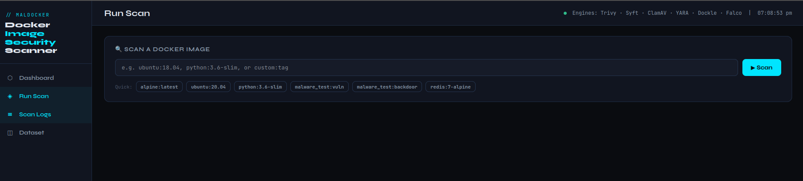
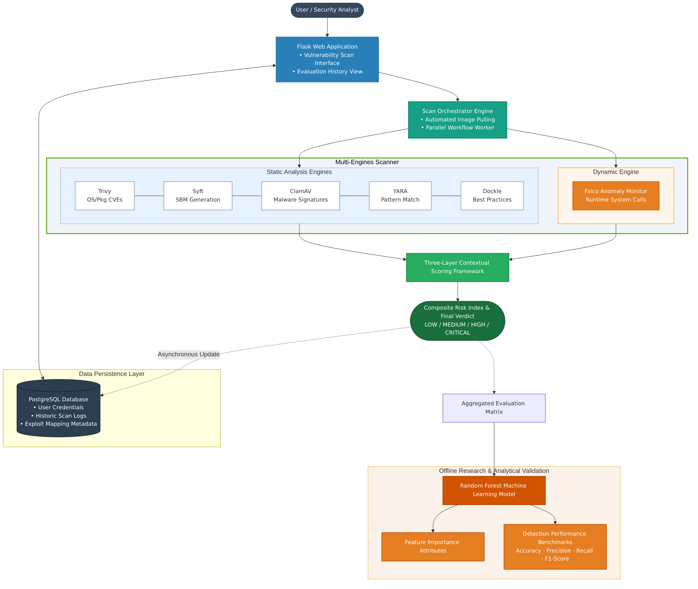

# 🛡️Beyond the CVE: Trapping Malware and Vulnerabilities in Container Base Images

## 🧐 Overview
**If you've ever wondered whether a Docker image you pulled from the internet is actually safe this tool is for you.
Standard scanners like Trivy do a decent job checking for outdated packages, but they're essentially just reading the label on the box. They don't look inside. This project does both: it cracks open the image, digs through the file system, runs the container in a controlled environment, and watches what it actually does at runtime.
The end result? A single risk score from 0 to 100, and a clear verdict: pass or block.**

**How it works:**
**The scanner runs your image through four stages:** 
1.  Pull the image and **extracts** its file system
2.  **Scans** for hidden malware, viruses, signatures, CVEs, and secrets (Static Analysis).
3.  **Executes** or  **Boot** the container in a sandbox to watch for suspicious behavior (Dynamic Analysis).
4.  **Aggregates** all findings into a single **Risk Score (0-100)** and **Final verdict(Low/Medium/High/Critical)**.

Nothing you need to stitch together manually or go to each tool and check its vulnerabilities, it's all automated through a web dashboard.

## Examples of GUI

| Web Dashboard (Web UI) | Run Scan(enter image_name) |
|:---:|:---:|
|  |  |

| Images Samples (Datasets) | History (Scan Logs) |
|:---:|:---:|
|  |  |

---

## 🚀 Key Features

* **Multi-Scanner Integration:**
    * **Trivy:** Detects OS and package vulnerabilities (CVEs).
    * **YARA:** matches against custom malware patterns (e.g., specific strings/suspicious strings in binaries).
    * **ClamAV:** classic antivirus, checks for known virus signatures
    * **Falco:** Monitors runtime system calls while the container runs( e.g.,catches things like unexpected shells spawning/unexpected shell usage).
    * **Syft:** generates a Software Bill of Materials, so you know exactly what's in the image
    * **Dockle:**  checks whether the image follows Docker security best practices
   

* **Smart Risk Scoring:**
* The scoring isn't just a straight average; it's weighted by severity. Calculates a normalized score (0-100).
  *Found malware? Doesn't matter what else is clean. **Risk Score: 100, Final verdict: Critical.**
  *High-severity CVEs or suspicious runtime behavior? You'll land in the **High or Medium** range.
  *Everything looks fine? **Low** risk, image passes.


---

## ⚙️ System Architecture

The scanner operates in a 4-step hybrid pipeline.


* **How the pipeline works:**
   *Step 1 — Click it off
       *Enter an image name in the dashboard. Then the orchestrator  will be pulling it automatically and queues it up for scanning.
   *Step 2 — Two scans run in parallel**
        *While the static scanners (Trivy, Syft, ClamAV, YARA, Dockle) comb through the image at rest, Falco boots the container in a sandbox and watches what it actually does at runtime. Both tracks run simultaneously.
   *Step 3 — Everything gets scored**
      *Results from both tracks feed into the scoring framework, which normalizes the data and produces a single risk verdict — Low, Medium, High, or Critical. The result is saved to the database and formatted for the dashboard.
   *Step 4 — ML validates the whole thing:**
      *The aggregated results are passed to a Random Forest model that goes beyond just scoring; it identifies which factors actually drove the risk and benchmarks the framework's overall accuracy using Precision, Recall, and F1-Score.

* **Web Dashboard:**
    * Simple UI to input `image_name:version_tag`.(e.g., Ubuntu:22.04 )
    * Real-time scanning status.
    * "Low/Medium/High/Critical"  verdict will give you how safe/malicious the image is.
      
## 💻 Installation & Setup
**Recommended Environment:**
You'll need Ubuntu 20.04 or 22.04 — either a VM or a native install. Some tools here (especially Falco) are Linux-only and won't work properly on Windows or standard WSL2.
Note: This project relies on Linux-specific tools (Falco, ClamAV) and is optimized for Linux environments.
### 1. System Prerequisites
Run the following commands in your Ubuntu terminal to install the necessary engines:
```bash
# Update repositories
sudo apt-get update

# Install ClamAV & YARA (Antivirus & Pattern Matching)
#note: libyara-dev is needed for the Python binding to work
sudo apt-get install clamav clamav-daemon yara libyara-dev -y

# Install Trivy (Vulnerability Scanner)
#Trivy is not in default repos, so we install it manually:` 
sudo apt-get install wget apt-transport-https gnupg lsb-release -y
wget -qO - [https://aquasecurity.github.io/trivy-repo/deb/public.key](https://aquasecurity.github.io/trivy-repo/deb/public.key) | sudo apt-key add -
echo deb [https://aquasecurity.github.io/trivy-repo/deb](https://aquasecurity.github.io/trivy-repo/deb) $(lsb_release -sc) main | sudo tee -a /etc/apt/sources.list.d/trivy.list
sudo apt-get update
sudo apt-get install trivy

# Make sure Docker is installed and running
sudo systemctl start docker
sudo usermod -aG docker $USER
```
(Note: Falco must be installed separately following the official Falco docs).

### 2. Clone & Install Project https://github.com/Dororo019/Hybrid-Framework-for-Detecting-Vulnerable-and-Malicious-Docker-Images
```bash
git clone [https://github.com/Dororo019/MalDockerScanner.git](https://github.com/Dororo019/MalDockerScanner.git)
cd malicious-docker-images-scanner
```
```bash
# Create and Activate Virtual Environment
python3 -m venv venv
source venv/bin/activate
```
```bash
# Install Python dependencies
pip3 install -r requirements.txt
```
### 3. Run the Scanner
```bash
python3 run.py
```
The application will start on http://localhost:5000.

## 🕵️ Usage Guide

### 1. Scanning Standard Images (Docker Hub)
The scanner can analyze **any** Docker image present on your system (pulled from Docker Hub or built locally).

**Example: Scanning the official Nginx image**
1.  Pull whatever image you want first:
    ```bash
    docker pull nginx:latest
    ```
2.  Go to the Web Dashboard (`http://localhost:5000`).
3.  Enter the image name:
    ```text
    nginx:latest
    ```
    into the input field, and hit **Initialize Scan**. The tool takes it from there.The tool will extract the file system and run all checks (Trivy, YARA, ClamAV, Falco....).

### 2. Scanning Custom/Local Images
You can also scan images you have built yourself. Just ensure the image exists in your local registry by running  `docker images` or as long as the image shows up in there.you can scan it the same way; just enter the name and tag.


---

## 🧪 Want to see it catches something
To prove the efficacy of the scanner, we have created custom images that mimic real-world threats.
One of the test images specifically to trigger the scanner so you can verify it's actually working.
Test 1 — Signature detection (contains the EICAR test string, which trips ClamAV and YARA):
```bash
# Run this from inside the /malware_test folder
docker build -f Dockerfile.poisoned -t scanner-test:poisoned.
```
Scan scanner-test:poisoned → you should get CRITICAL, with a score of 77 .

Test 2 — Behavior detection (runs a script that mimics a crypto-miner, which Falco catches):
```bash
docker build -f Dockerfile.behavior -t dangerous-behavior:latest .
```
Scan dangerous-behavior:latest → you should get HIGH RISK.

* Scan other images as well by following the same steps, such as by entering the image name and the respective tag version.

## 📁 Project Structure
* app/: Web dashboard (Flask) and HTML templates.
* static_scan/: Trivy, YARA, and ClamAV logic.
* dynamic_scan/: Scripts for running the container and parsing Falco logs.
* ml_model/: Risk Score calculation.
* malware_test/: The test Dockerfiles for demos and validation

## 🔧 Troubleshooting

* **Error: `docker: permission denied`**
    * **Fix:** Your user isn't in the docker group yet. Run `sudo usermod -aG docker $USER` and log out and back in (or reboot the VM).
    * **Fix:** You're probably on Windows or WSL2. Make sure you are running on a Linux host/VM.  Falco needs direct kernel access; it won't work without a proper Linux host or VM.
* **Scanner hangs on "Pulling image..."**
    * **Fix:** Docker needs a stable internet connection to download image layers. Check your network and try again. Also, sometimes it occurs due to the timeframe we set for analysis. You may change it or else just reduce the falco scan timer.


## References

* **Conference Papers**

1. Rui Shu, Xiaohui Gu, and William Enck. "A Study of Security Vulnerabilities on Docker Hub," Proceedings of the Seventh ACM Conference on Data and Application Security and Privacy (CODASPY '17). ACM, New York, NY, USA, 2017, pp. 269–280.

2. Mubin Ul Haque and M. Ali Babar. "Well Begun is Half Done: An Empirical Study of Exploitability & Impact of Base-Image Vulnerabilities," 2022 IEEE International Conference on Software Analysis, Evolution and Reengineering (SANER), 2022.

3. Ruchika Malhotra, Anjali Bansal, and Marouane Kessentini. "Vulnerability Analysis of Docker Hub Official Images and Verified Images," 2023 IEEE International Conference on Service-Oriented System Engineering (SOSE), Athens, Greece, 2023, pp. 150-155.

4. Vivek Saxena, Deepika Saxena, and Uday Pratap Singh. "Security Enhancement using Image verification method to Secure Docker Containers," Proceedings of the 4th International Conference on Information Management & Machine Intelligence (ICIMMI '22). ACM, New York, NY, USA, 2023, Article 42, pp. 1–5.

* **Journal Articles & Surveys** 

5. Devi Priya V S, Sibi Chakkaravarthy Sethuraman, and Muhammad Khurram Khan. "Container security: Precaution levels, mitigation strategies, and research perspectives," Computers & Security, Volume 135, 2023.
6. Omar Jarkas, Ryan Ko, Naipeng Dong, and Redowan Mahmud. "A Container Security Survey: Exploits, Attacks, and Defenses," ACM Computing Surveys, Vol. 57, No. 7, Article 170, July 2025.
7. Juan M. Corchado, Byung-Gyu Kim, Carlos A. Iglesias, In Lee, Fuji Ren, and Rashid Mehmood. "Experimental Analysis of Security Attacks for Docker Container Communications," Electronics (MDPI), 2023, 12(4):940.
8. Rui Queiroz, Tiago Cruz, Jérôme Mendes, Pedro Sousa, and Paulo Simões. "Container-based Virtualization for Real-time Industrial Systems—A Systematic Review," ACM Computing Surveys, 2023.
9. Ajith, V., Cyriac, T., Chavda, C., Kiyani, A. T., Chennareddy, V., & Ali, K. "Analyzing Docker Vulnerabilities through Static and Dynamic Methods and Enhancing IoT Security with AWS IoT Core, CloudWatch, and GuardDuty," Preprints, 2024.

* **Online Resources & Tools**

10. Docker Security Documentation: https://docs.docker.com/engine/security/ 
11. Tigera.io: "Container Vulnerability Scanning: Importance & 10 Best Practices." 
12. GitGuardian: "Container Security Scanning: Vulnerabilities, Risks, and Tooling," GitGuardian Blog. 
13. CrowdStrike: "Container Security Explained," CrowdStrike Cybersecurity 101. 
14. GitHub - anchore/grype: A vulnerability scanner for container images and filesystems. 
15. GitHub - anchore/syft: CLI tool and library for generating a Software Bill of Materials from container images.
16. ClamAV: Open-Source Antivirus Software Toolkit for UNIX (Cisco Talos Intelligence Group).

